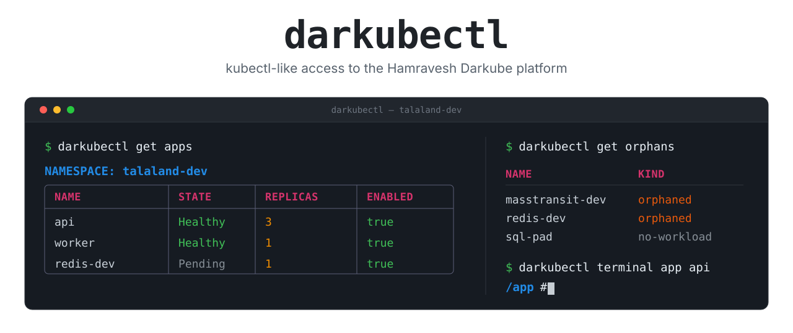

<div align="center">
  <picture>
    <source media="(prefers-color-scheme: dark)" srcset="assets/banner-dark.svg">
    
  </picture>
</div>

<div align="center">

[](https://github.com/rahacloud/darkubectl/actions/workflows/ci.yml)
[](https://github.com/rahacloud/darkubectl/releases/latest)
[](https://pkg.go.dev/github.com/rahacloud/darkubectl)
[](https://goreportcard.com/report/github.com/rahacloud/darkubectl)
[](https://github.com/rahacloud/darkubectl/releases)
[](LICENSE)

**Your [Darkube](https://darkube.app) apps, from the terminal.** List, inspect, tail, shell into and create apps on the Hamravesh platform — without opening the console.

</div>

## Why

Darkube is a good PaaS with one gap: everything runs through the web console. There is no `kubectl` for it, no way to grep a log, no way to script a deploy check, no way to see that a deleted app left its Helm release running in your cluster.

`darkubectl` is that missing CLI. It speaks the Hamravesh API (`https://api.hamravesh.com`) and its websockets directly, so the mental model is the one you already have: **tenant** = organization, **namespace** = project, **app** = workload.

```sh
darkubectl get apps -o wide          # instead of five clicks
darkubectl logs app api -f           # instead of the log panel
darkubectl terminal app api          # instead of the web terminal
darkubectl get orphans               # something the console cannot tell you at all
```

## Highlights

| | |
| --- | --- |
| 🔎 **Familiar verbs** | `get`, `describe`, `logs`, `exec`, `create`, `delete` — the kubectl muscle memory carries over. |
| 🧭 **Real terminals** | `terminal app <name>` opens an interactive shell over the exec websocket, resize and all. `exec` runs one-off commands. |
| 📜 **Logs that pipe** | `logs -f` to follow, `--previous` for the container that just crashed, `--timestamps` for correlation. |
| 👻 **Orphan detection** | `get orphans` reconciles your tenant against a live cluster and finds the Helm releases Darkube left behind on delete. Nothing else surfaces these. |
| 🎨 **Readable output** | Colorized tables and a `describe -i` interactive viewer with search, degrading to plain text the moment you pipe it. |
| 🤖 **Scriptable** | `-o json`, `-o yaml`, `-o name` on everything, config via flags, env or file, and `get deploy-token` to wire a CI pipeline without the console. |
| 🔐 **Two auth modes** | An account API key for scripting, or a full 2FA Console login (TOTP) for terminals and app creation. |
| 📦 **One static binary** | Go, no client-go, no runtime deps. Linux, macOS and Windows on amd64 and arm64. |

## Install

**Homebrew** (macOS):

```sh
brew install rahacloud/tap/darkubectl
```

**Go**:

```sh
go install github.com/rahacloud/darkubectl@latest
```

**Binaries** — grab a tarball for your platform from the [latest release](https://github.com/rahacloud/darkubectl/releases/latest):

```sh
curl -sSfL https://github.com/rahacloud/darkubectl/releases/latest/download/darkubectl_$(curl -s https://api.github.com/repos/rahacloud/darkubectl/releases/latest | grep -o '"tag_name": "v[^"]*' | cut -d'v' -f2)_$(uname -s | tr '[:upper:]' '[:lower:]')_$(uname -m | sed 's/x86_64/amd64/;s/aarch64/arm64/').tar.gz | tar xz darkubectl
sudo install darkubectl /usr/local/bin/
```

**From source**:

```sh
git clone https://github.com/rahacloud/darkubectl && cd darkubectl && go build -o darkubectl .
```

## Quickstart

```sh
darkubectl config use-tenant <org-slug>     # e.g. rahacloud
darkubectl config set-token <your-api-key>  # from the Darkube console
darkubectl get apps
```

That covers everything read-only. For pod terminals and app creation, add a Console login:

```sh
darkubectl login                            # email + password + TOTP
darkubectl terminal app <name>
```

## Authentication

Every request is scoped to an active **tenant** (organization) via the `X-Organization: <tenant-slug>` header, and carries one of two credentials:

- an **account API key** — `Authorization: Api-key <token>`; or
- a **Console JWT** from `darkubectl login` — `Authorization: Bearer <jwt>`.

Either credential drives the whole REST API. The Api-key is the simplest for scripting; a login is required additionally for the **terminal/exec** websocket (the Api-key cannot open it). If both are configured, the Api-key is used for REST and the JWT for the terminal.

Config is stored at `~/.darkube/config.yaml` (override with `$DARKUBE_CONFIG`), written `0600`. Values can also be supplied via environment or flags, which take precedence:

| Setting  | Flag         | Environment        | Config key       |
| -------- | ------------ | ------------------ | ---------------- |
| Token    | `--token`    | `DARKUBE_TOKEN`    | `token`          |
| Tenant   | `--org`/`-n` | `DARKUBE_ORG`      | `current-tenant` |
| Base URL | `--base-url` | `DARKUBE_BASE_URL` | `base-url`       |
| Config   | `--config`   | `DARKUBE_CONFIG`   | —                |

## Usage

```sh
# Tenants (organizations)
darkubectl get tenants
darkubectl config use-tenant talaland

# Apps
darkubectl get apps                    # table
darkubectl get apps -o wide            # + cluster, RAM, CPU, domain, id
darkubectl get apps -o json
darkubectl describe app <name|id>      # colorized key/value view
darkubectl describe app <name|id> -i   # interactive: scroll + / search
darkubectl describe app <name|id> -o yaml

# Other resources
darkubectl get namespaces              # projects (derived from apps)
darkubectl get certificates
darkubectl get plans

# CI credentials — the pair `darkube deploy` needs in a pipeline
darkubectl get deploy-token <name|id>          # app id + trigger deploy token
darkubectl get deploy-token <name|id> -o name  # the bare token, for a CI variable

# Reconcile Darkube against a cluster (needs kubectl on PATH)
darkubectl get orphans                                  # every namespace in the current context
darkubectl get orphans --context <ctx> --namespace <ns>

# Mutations (all prompt for confirmation; pass -y to skip)
darkubectl scale app <name|id> --replicas 3
darkubectl patch app <name|id> -p '{"ram_limit": "1024M"}'
darkubectl delete app <name|id>

# Create an app from a Docker image (needs a JWT login; see below)
darkubectl get plans                       # pick a plan (NAME column → --plan)
darkubectl get namespaces                  # pick a namespace (ID column → --namespace)
darkubectl create app my-api --namespace <ns> --plan 1 --image nginx:latest
darkubectl create app -f spec.yaml         # from a YAML spec (ports, disk, env)
darkubectl create app -i                   # interactive prompts

# Logs
darkubectl logs app <name>                # last 100 lines (pod auto-detected)
darkubectl logs app <name> --tail 500 -f  # follow
darkubectl logs app <name> --previous     # the container instance that crashed
darkubectl logs app <name> --timestamps --pod <p> -c <container>

# Terminal / exec — needs a JWT login (separate from the Api-key)
darkubectl login                          # email + password + TOTP → stores a refresh token
darkubectl get pods <name>                # an app's running pods (via the app-state stream)
darkubectl exec app <name> -- ls -la      # run a command in a pod
darkubectl terminal app <name>            # interactive shell (auto-detects the pod; alias: shell)
darkubectl terminal app <name> --pod <p> -c <container>
```

Output format is controlled by `-o/--output`: `table` (default), `wide`, `json`, `yaml`, or `name`. Scope any single command to a different tenant with `-n <org>`.

### The app spec file

Flags cover the flat fields. Ports, persistent storage and environment variables are nested, so they are `--file` only:

```yaml
name: masstransit-dev
namespace: "175864"        # id, or a name — ids always work, see below
plan: "1"                  # plan NAME from `get plans`, or its id
image: masstransit/rabbitmq:3.13.1
replicas: 1
svcType: ClusterIP         # or LoadBalancer; defaults to ClusterIP
ports:                     # keyed by name; "main" is the one ingress targets
  amqp: {containerPort: 5672, servicePort: 5672, protocol: TCP}
  main: {containerPort: 15672, servicePort: 15672, protocol: TCP}
disk:
  sizeInGi: 4
  setFsGroup: true
  storageClassName: rawfile-btrfs   # required — omitting it makes the API 500
  partitions:
    - {name: data, mountPath: /var/lib/rabbitmq/mnesia, subPath: data}
envs:
  - {name: RabbitMq__Host, value: masstransit-dev.talaland-dev.svc}
secretEnvs:
  - {name: RabbitMq__Password, value: hunter2}
```

**Set these at creation time or not at all.** `PATCH` on an existing app currently returns 500 for every field, so `patch app` and `scale app` do not work and an app created without its ports, disk or environment cannot be completed through the API — only through the console. Getting the spec right up front avoids a delete-and-recreate.

Namespaces resolve by name when they already contain an app; a brand-new empty project has to be referenced by id, which `get namespaces` prints.

**A multi-port spec is not proven to work.** The example above is the real `masstransit-dev` spec, and the app it produced has no container ports and no Service at all — `darkube deploy` reported success and said nothing. Every single-port app created alongside it got its Service, so `main` on its own is the shape known to work. Treat the second port as unverified rather than broken: that app was later deleted and its release orphaned (see below), which is a second candidate explanation nobody has separated from the first.

### Orphaned releases

Deleting an app removes it from the API at once and tears its Helm release down separately — and the release is routinely left behind. It keeps running, keeps its `darkube.hamravesh.com/app-id` label, and keeps the name, so recreating under that name fails with `SameHelmReleaseNameExists` indefinitely. Neither side shows this on its own: `get apps` cannot list an app that no longer exists, and the cluster looks entirely normal.

`get orphans` is the reconciliation, comparing the tenant's apps against the Deployments in a cluster:

```sh
darkubectl get orphans --context <ctx> --namespace <ns>
```

```text
NAME              NAMESPACE      KIND       APP-ID
masstransit-dev   talaland-dev   orphaned   a5895ea3-ebea-4356-af55-e60835fd47f0
redis-dev         talaland-dev   orphaned   72050779-4c43-4c29-90c1-86d0ca066d5f
```

`orphaned` is a workload whose app is gone; `no-workload` is the reverse, an app with nothing in the cluster carrying its id. Only namespaces the cluster returns are compared, because a tenant's apps span several clusters while one kubeconfig context reaches one of them.

Clearing an orphan needs the console or Hamravesh support — there is no `force`/`adopt` flag on create and no release endpoint in the API. The command tells you the name is taken and why; it cannot free it.

This shells out to `kubectl` rather than linking client-go, which keeps the dependency tree small and inherits whatever kubeconfig, context and OIDC exec-plugin credentials already work for you.

### Logging in

`darkubectl login` obtains a Console JWT and stores the (long-lived) refresh token, from which access tokens are minted automatically. There are several ways to provide it — a refresh token is as powerful as a full login:

```sh
darkubectl login                              # interactive: email + password + TOTP (2FA)
darkubectl login --refresh-token <token>      # store an existing refresh token (no 2FA)
some-vault get token | darkubectl login --refresh-token-stdin
export DARKUBE_REFRESH_TOKEN=<token>          # refresh token from the environment
export DARKUBE_ACCESS_TOKEN=<jwt>             # a ready access token (used verbatim)
```

The account API key **cannot** open a pod terminal or create apps — the exec websocket (`wss://…/ws/aexec/`) and app creation require the JWT. Force the JWT even when an Api-key is configured by unsetting it: `DARKUBE_TOKEN= darkubectl …`.

## What works, and what does not

The Darkube API has no public documentation; every endpoint here was reverse-engineered against a live account and is noted as confirmed or not in [`CLAUDE.md`](CLAUDE.md). Two things to know up front:

- **`PATCH` is broken server-side** — it returns 500 for every field on both API versions, which makes `patch app` and `scale app` non-functional. Configuration has to be right at creation time.
- **Delete is asynchronous and orphans releases** — see [Orphaned releases](#orphaned-releases). `get orphans` exists because this is the common case, not the edge case.

Everything else — listing, describing, logs, exec, terminals, create, deploy tokens — is confirmed working.

## Development

```sh
go build ./...
go test -race ./...
golangci-lint run ./...
```

The demo GIF is generated with [VHS](https://github.com/charmbracelet/vhs):

```sh
brew install vhs
vhs demo/demo.tape     # runs against your configured tenant → assets/demo.gif
```

Architecture, the reverse-engineered API/auth details, and contributor conventions live in [`CLAUDE.md`](CLAUDE.md).

## Contributing

Issues and pull requests are welcome — especially new endpoint findings, since the API surface is mapped by observation. Keep `golangci-lint` at zero issues and `go test -race ./...` green, and the CI will agree with you.

If `darkubectl` saved you a trip to the console, a ⭐ helps other Darkube users find it.

---

<div align="center">
  
  <br>
  <sub>Built and maintained by <a href="https://github.com/rahacloud">Raha Cloud</a> · GPL-3.0</sub>
</div>
